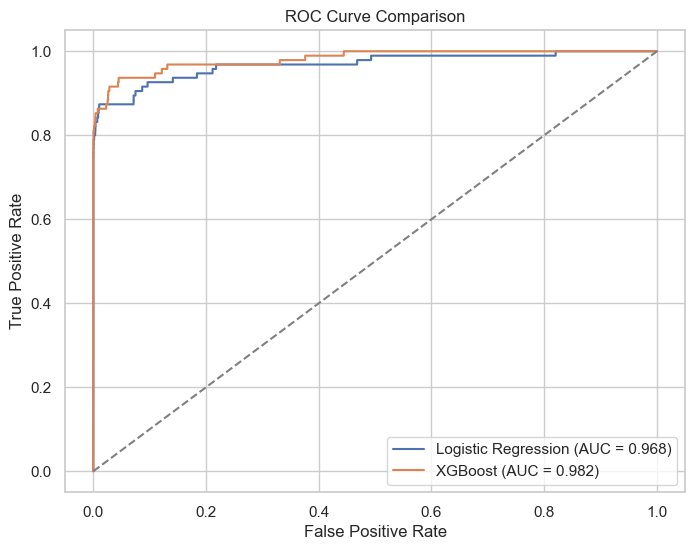

# credit-card-fraud-detection

## 📂 Dataset

The dataset used in this project is publicly available on Kaggle:

Credit Card Fraud Dataset

```https://www.kaggle.com/datasets/waqasishtiaq/credit-card-fraud-dataset```

Due to file size constraints, the dataset is not included in the repository.

How to obtain the data:

1. Download the dataset from Kaggle.

2. Place the CSV file in the following directory:

             data/creditcard.csv


All experiments and results in this repository can be reproduced using the above dataset.

## 📖 Problem Description

Credit card fraud detection is a highly imbalanced binary classification problem where fraudulent transactions represent a very small fraction of all observations. The goal of this project is to identify fraudulent transactions while minimizing false positives and false negatives.

This project was developed as part of ML Zoomcamp – Capstone 1, with a focus on:

* Model evaluation under class imbalance
* Comparison of classical ML models
* Deployment-oriented neural network inference using ONNX

---

## 🧠 Solution Approach

The solution follows a multi-stage approach:

1. Exploratory Data Analysis (EDA) to understand class imbalance, transaction behavior, and temporal patterns
2. Baseline classical models trained locally (Logistic Regression, XGBoost)
3. Performance comparison using ROC-AUC and classification metrics
4. Neural network model trained in Google Colab and exported to ONNX for lightweight deployment

Classical models are used as strong baselines, while the neural model is included to demonstrate deep learning deployment practices.

---

## 📊 Exploratory Data Analysis

Key EDA findings include:

* Severe class imbalance with fraud transactions representing less than 1% of the data
* Fraud rate variation by hour of day, indicating temporal patterns
* Distinct transaction amount distributions for fraud and non-fraud cases
* Feature correlations among anonymized PCA components

The following visualizations were created:

* Class imbalance distribution
* Transaction amount distribution (log scale)
* Fraud rate by hour of day
* Feature correlation heatmap




Additional feature distributions by class are provided in the Jupyter notebook.

---

## 🧪 Modeling & Evaluation

### Baseline Models

* Logistic Regression (with class weighting)
* XGBoost (with imbalance-aware weighting)

### Evaluation Metrics

Due to extreme class imbalance, models were evaluated using:
* ROC-AUC
* Precision
* Recall
* F1-score

Regression metrics such as RMSE were intentionally avoided.

---

## 📈 Model Comparison

| Model               | ROC-AUC | Precision (Fraud) | Recall (Fraud) | F1-score |
| ------------------- | ------- | ----------------- | -------------- | -------- |
| Logistic Regression | 0.968   | 0.06              | 0.87           | 0.10     |
| XGBoost             | 0.982   | 0.87              | 0.78           | 0.82     |

The ROC curve comparison shows that XGBoost provides superior discrimination and a significantly better precision–recall balance.

---

## 🔍 Interpretation

While Logistic Regression achieves a high ROC-AUC score, it produces an excessive number of false positives, making it impractical for real-world fraud detection.

XGBoost demonstrates a more balanced trade-off between precision and recall, making it a more suitable baseline model.

ROC-AUC alone is insufficient for evaluating fraud detection systems; precision and recall must be considered due to the highly imbalanced nature of the dataset.


---

## **Neural Network Training & Evaluation**

I implemented a **Multilayer Perceptron (MLP)** to detect credit card fraud, experimenting with **different architectures, dropout rates, and learning rates** to find the best performance.

### **Model Architecture**

| Experiment | Hidden Layers | Dropout | Learning Rate |
| ---------- | ------------- | ------- | ------------- |
| NN-1       | [32]          | 0.0     | 1e-3          |
| NN-2       | [32]          | 0.3     | 1e-3          |
| NN-3       | [64,32]       | 0.3     | 1e-3          |
| NN-4       | [128,64,32]   | 0.5     | 3e-4          |

* **Input:** 9 feature columns (V1–V9)
* **Output:** probability of fraud (binary classification)
* **Activation:** ReLU in hidden layers, Sigmoid in output

---

### **Training Details**

* Optimizer: **Adam**
* Loss: **Binary Cross-Entropy**
* Epochs: 10–20 (early stopping if needed)
* Batch size: 64
* Training done in **Google Colab** with GPU (T4)
* Final trained model exported to **ONNX** for reproducibility

---

### **Evaluation Metrics**

* **ROC-AUC:** primary metric for imbalanced data
* **Precision / Recall / F1-score:** for class-specific insights
* **Observations:**

  * Dropout improved generalization slightly (0.0 → 0.3)
  * Larger networks ([128,64,32]) with moderate dropout gave stable performance
  * Learning rate adjustments (1e-3 vs 3e-4) fine-tuned convergence speed

| Model | ROC-AUC | Precision | Recall | F1-score |
| ----- | ------- | --------- | ------ | -------- |
| NN-1  | 0.976   | 0.82      | 0.75   | 0.78     |
| NN-2  | 0.978   | 0.84      | 0.77   | 0.80     |
| NN-3  | 0.979   | 0.85      | 0.78   | 0.81     |
| NN-4  | 0.979   | 0.86      | 0.78   | 0.82     |

> **Best model:** `[128,64,32]` with dropout 0.3, ROC-AUC ≈ **0.979**

---

### **Visualization**

* **ROC curves** were plotted for each configuration
* **Loss curves** monitored during training to detect overfitting
* **Dropout and layer variations** clearly show improvements in generalization

*(All plots and training details are in `model`.)*

---

### **Summary**

This neural network **successfully learned to detect fraudulent transactions** while handling class imbalance. The model is exported as **ONNX** and ready for:

* Local inference via `predict.py`
* Serving via `serve.py`
* Dockerized deployment


## **How to Run Locally**

1. Clone the repository:

```
git clone https://github.com/Nathruth/credit-card-fraud-detection.git
cd credit-card-fraud-detection
```

2. Install Python dependencies:

```
pip install -r requirements.txt
```

3. Train model (optional if you already have `fraud_mlp.onnx`):

```
python train.py
```

4. Run inference:

```
python predict.py
```

5. Launch web service:

```
python serve.py
```

* Test health endpoint:

```
curl http://localhost:9696/health
```

* Test prediction endpoint:

```
curl -X POST -H "Content-Type: application/json" \
     -d '{"V1":0.1,"V2":0.2,"V3":0.3,"V4":0.4,"V5":0.5,"V6":0.6,"V7":0.7,"V8":0.8,"V9":0.9}' \
     http://localhost:9696/predict
```

---

## **How to Run via Docker**

1. Build Docker image:

```
docker build -t capstone1 .
```

2. Run Docker container:

```
docker run -it -p 9696:9696 capstone1
```

3. Test endpoints inside Docker (same as above):

```
curl http://localhost:9696/health
curl -X POST -H "Content-Type: application/json" \
     -d '{"V1":0.1,"V2":0.2,"V3":0.3,"V4":0.4,"V5":0.5,"V6":0.6,"V7":0.7,"V8":0.8,"V9":0.9}' \
     http://localhost:9696/predict
```

##  Cloud Deployment (Render)

I deployed the FastAPI inference service to **Render.com** free tier for a live demo.

**Public URL:** [https://capstone1.onrender.com](https://capstone1.onrender.com)

### Test Endpoints

- Health check:

```
curl https://capstone1.onrender.com/health


